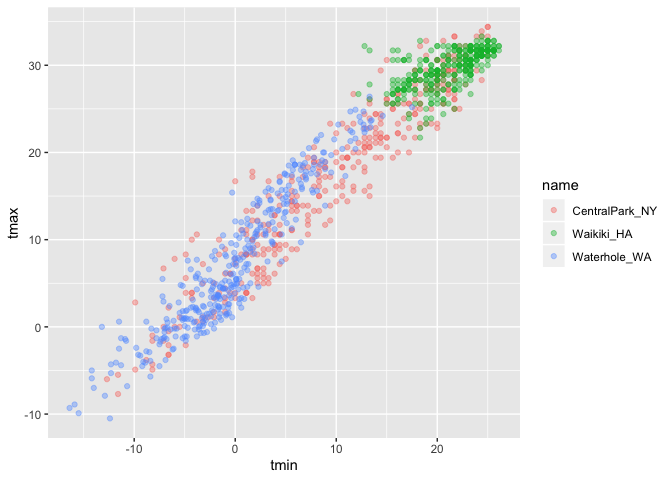
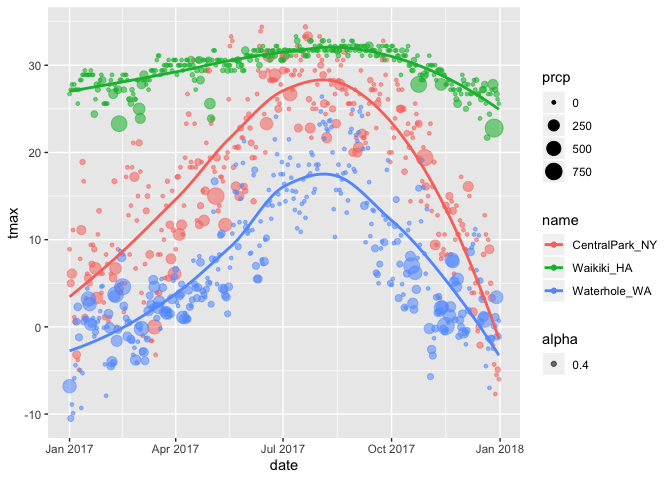

ggplot1
================
Ava Hamilton
9/26/2019

## download/manipulate data

``` r
### downloads data (weather monitoring stations, then variables want, and then between two dates)
weather_df = 
  rnoaa::meteo_pull_monitors(c("USW00094728", "USC00519397", "USS0023B17S"),
                      var = c("PRCP", "TMIN", "TMAX"), 
                      date_min = "2017-01-01",
                      date_max = "2017-12-31") %>%
  mutate(
    name = recode(id, USW00094728 = "CentralPark_NY", 
                      USC00519397 = "Waikiki_HA",
                      USS0023B17S = "Waterhole_WA"),
    tmin = tmin / 10,
    tmax = tmax / 10) %>%
  select(name, id, everything())
```

    ## Registered S3 method overwritten by 'crul':
    ##   method                 from
    ##   as.character.form_file httr

    ## Registered S3 method overwritten by 'hoardr':
    ##   method           from
    ##   print.cache_info httr

    ## file path:          /Users/avahamilton/Library/Caches/rnoaa/ghcnd/USW00094728.dly

    ## file last updated:  2019-09-26 10:25:52

    ## file min/max dates: 1869-01-01 / 2019-09-30

    ## file path:          /Users/avahamilton/Library/Caches/rnoaa/ghcnd/USC00519397.dly

    ## file last updated:  2019-09-26 10:26:02

    ## file min/max dates: 1965-01-01 / 2019-09-30

    ## file path:          /Users/avahamilton/Library/Caches/rnoaa/ghcnd/USS0023B17S.dly

    ## file last updated:  2019-09-26 10:26:05

    ## file min/max dates: 1999-09-01 / 2019-09-30

``` r
weather_df
```

    ## # A tibble: 1,095 x 6
    ##    name           id          date        prcp  tmax  tmin
    ##    <chr>          <chr>       <date>     <dbl> <dbl> <dbl>
    ##  1 CentralPark_NY USW00094728 2017-01-01     0   8.9   4.4
    ##  2 CentralPark_NY USW00094728 2017-01-02    53   5     2.8
    ##  3 CentralPark_NY USW00094728 2017-01-03   147   6.1   3.9
    ##  4 CentralPark_NY USW00094728 2017-01-04     0  11.1   1.1
    ##  5 CentralPark_NY USW00094728 2017-01-05     0   1.1  -2.7
    ##  6 CentralPark_NY USW00094728 2017-01-06    13   0.6  -3.8
    ##  7 CentralPark_NY USW00094728 2017-01-07    81  -3.2  -6.6
    ##  8 CentralPark_NY USW00094728 2017-01-08     0  -3.8  -8.8
    ##  9 CentralPark_NY USW00094728 2017-01-09     0  -4.9  -9.9
    ## 10 CentralPark_NY USW00094728 2017-01-10     0   7.8  -6  
    ## # … with 1,085 more rows

## create a ggplot

``` r
ggplot(weather_df, aes(x = tmin, y = tmax)) +
  geom_point()
```

    ## Warning: Removed 15 rows containing missing values (geom_point).

<!-- -->

## alternative way of making this plot

``` r
weather_df %>%
  ggplot(aes(x = tmin, y = tmax))+
  geom_point()
```

    ## Warning: Removed 15 rows containing missing values (geom_point).

<!-- -->

\#\#saving initial plots - jeff doesnt really use this

``` r
scatter_plot = 
  weather_df %>%
  ggplot(aes(x = tmin, y = tmax))+
  geom_point()

scatter_plot
```

    ## Warning: Removed 15 rows containing missing values (geom_point).

<!-- -->

### adding color

``` r
weather_df %>%
  ggplot(aes(x = tmin, y = tmax)) +
  geom_point(aes(color = name), alpha = 0.4) #alpha does some transparency
```

    ## Warning: Removed 15 rows containing missing values (geom_point).

<!-- -->

Why do ‘aes’ positions matter?

``` r
weather_df %>%
  ggplot(aes(x = tmin, y = tmax)) + ### defines aesthetic mappings for everything that happens after it
  geom_point(aes(color = name), alpha = 0.4) + #color mapping only applies to geom_point. If want it to apply to geom_smooth then put it in ggplot aes
  geom_smooth(se = FALSE) #curve going through plot and se = FALSE gets rid of CI
```

    ## `geom_smooth()` using method = 'gam' and formula 'y ~ s(x, bs = "cs")'

    ## Warning: Removed 15 rows containing non-finite values (stat_smooth).

    ## Warning: Removed 15 rows containing missing values (geom_point).

<!-- -->

``` r
weather_df %>%
  ggplot(aes(x = tmin, y = tmax, color = name)) + 
  geom_point(alpha = 0.4) +
  geom_smooth(se = FALSE) + 
  facet_grid(. ~ name)
```

    ## `geom_smooth()` using method = 'loess' and formula 'y ~ x'

    ## Warning: Removed 15 rows containing non-finite values (stat_smooth).

    ## Warning: Removed 15 rows containing missing values (geom_point).

<!-- -->

## this is fine but not interesting

``` r
weather_df %>% 
  ggplot(aes(x = date, y = tmax, color = name))+
  geom_point(aes(size = prcp, alpha = 0.4))+ ## point change size based on precipitaiton
  geom_smooth(se = F)
```

    ## `geom_smooth()` using method = 'loess' and formula 'y ~ x'

    ## Warning: Removed 3 rows containing non-finite values (stat_smooth).

    ## Warning: Removed 3 rows containing missing values (geom_point).

<!-- -->
